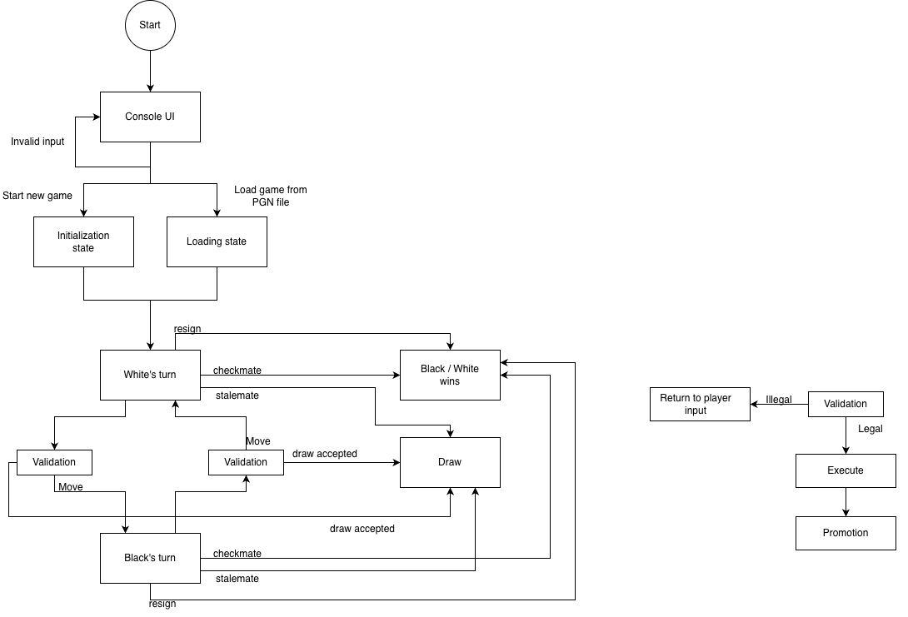

# PCHS-OOP-CONSOLE-CHESS-CPP

---
# File structure

```
console-chess-cpp/
├── CMakeLists.txt
├── README.md
│
├── include/                     # ONLY .h files (моля ви)
│   ├── board/
│   │   ├── Board.h
│   │   ├── Square.h
│   │   ├── Move.h
│   │   └── PawnPromotionHandler.h
│   │
│   ├── pieces/
│   │   ├── Piece.h
│   │   ├── Pawn.h
│   │   ├── Rook.h
│   │   ├── Knight.h
│   │   ├── Bishop.h
│   │   ├── Queen.h
│   │   └── King.h
│   │
│   ├── enums/
│   │   ├── Color.h
│   │   └── PieceType.h
│   │
│   ├── game/
│   │   └── Game.h
│   │
│   ├── cli/
│   │   ├── ChessCLI.h
│   │   ├── BoardPrinter.h
│   │   └── PieceRenderer.h
│   │
│   ├── input/
│   │   └── MoveParser.h
│   │
│   ├── timer/
│   │   └── GameTimer.h
│   │
│   └── pgn/
│       ├── PGNParser.h
│       └── PGNExporter.h
│
├── src/                         # ONLY .cpp files (моля ви)
│   ├── main.cpp
│   │
│   ├── board/
│   │   ├── Board.cpp
│   │   └── PawnPromotionHandler.cpp
│   │
│   ├── pieces/
│   │   ├── Piece.cpp
│   │   ├── Pawn.cpp
│   │   ├── Rook.cpp
│   │   ├── Knight.cpp
│   │   ├── Bishop.cpp
│   │   ├── Queen.cpp
│   │   └── King.cpp
│   │
│   ├── game/
│   │   └── Game.cpp
│   │
│   ├── cli/
│   │   ├── ChessCLI.cpp
│   │   ├── BoardPrinter.cpp
│   │   └── PieceRenderer.cpp
│   │
│   ├── input/
│   │   └── MoveParser.cpp
│   │
│   ├── timer/
│   │   └── GameTimer.cpp
│   │
│   └── pgn/
│       ├── PGNParser.cpp
│       └── PGNExporter.cpp
│
└── build/
```

---
## State diagram


